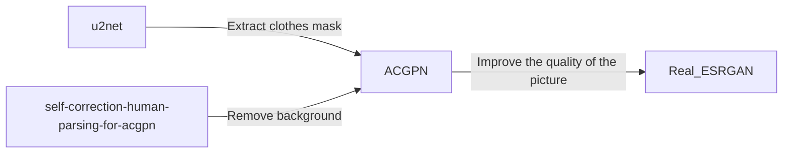

# COSMIC-tryon
2023 공개 SW 개발자 대회 가상피팅 프로젝트


## Team

| **이태윤 (팀장)** | **민선주** | **신소희** | **정희원** |
|:---:|:---:|:---:|:---:|
|  |  |  |  |


## Project Architecture


### Model Flowchart




## Tech Stack

| Field | Stack |
|:---:|:---|
| Language |  |
| App |  |
| Back-end |    |
| Data Base |    |
| ML & DL |    |


## Usage

- Back-end

    ```bash
    # 0. 가상환경 설치 전, liblzma-dev 설치
    $ sudo apt-get install liblzma-dev

    # 1. venv 설치
    $ python3.8.10 -m venv myenv

    # 2. venv 활성화
    $ source myenv/bin/activate

    # 3. 의존성 설치
    (myenv) $ pip install -r requirements.txt

    # 4. Microsoft ODBC 드라이버 설치 (Ubuntu 18.04 기준)
    
    # 4-1. 드라이버 패키지 다운로드
    $ sudo su
    $ curl https://packages.microsoft.com/keys/microsoft.asc | apt-key add -
    $ curl https://packages.microsoft.com/config/ubuntu/18.04/prod.list > /etc/apt/sources.list.d/mssql-release.list
    $ exit

    # 4-2. 패키지 목록 업데이트
    sudo apt-get update

    # 4-3. 드라이버 설치
    $ sudo ACCEPT_EULA=Y apt-get install msodbcsql18

    # 5. exampleapp.service 참고하여 tryonapp.service 작성
    # ...

    # 6. tryonapp.service를 복사
    $ sudo cp tryonapp.service /etc/systemd/system/

    # 7. tryonapp systemctl 실행
    $ sudo systemctl daemon-reload
    $ sudo systemctl start tryonapp

    # 8. tryonapp 서비스를 시스템 재부팅 시에도 자동 실행되도록 설정
    $ sudo systemctl enable tryonapp
    ```
