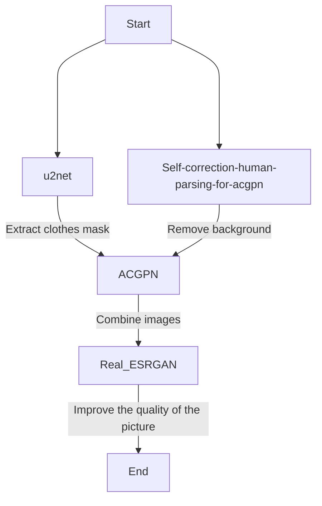

# COSMIC-tryon
2023 공개 SW 개발자 대회 가상피팅 프로젝트


## Team

| **이태윤 (팀장)** | **민선주** | **신소희** | **정희원** |
|:---:|:---:|:---:|:---:|
|  |  |  |  |


## Project Architecture


## Model Flowchart



- [U2NET](https://github.com/xuebinqin/U-2-Net)
- [Self Correction Human Parsing for ACGPN](https://github.com/GoGoDuck912/Self-Correction-Human-Parsing)
- [ACGPN](https://github.com/minar09/ACGPN)
- [Real ESRGAN](https://github.com/xinntao/Real-ESRGAN)


## Tech Stack

| Field | Stack |
|:---:|:---|
| Language |   |
| App |  |
| Back-end |    |
| Data Base |    |
| ML & DL |    |


## Usage

```bash
$ git clone https://github.com/troymerai/COSMIC-tryon.git
```

- Back-end

  - Do git clone to use models

    `/COSMIC-tryon/Backend$ tree -d -L 2`

    ```bash
    .
    ├── ACGPN # In the 'Backend' directory, do git clone ACGPN.
    │   ├── Data_preprocessing
    │   ├── Self-Correction-Human-Parsing-for-ACGPN # In the 'ACGPN' directory, do git clone Self-Correction-Human-Parsing-for-ACGPN.
    │   ├── U_2_Net # In the 'ACGPN' directory, do git clone U-2-Net, and change the name of this folder like this.
    │   ├── __pycache__
    │   ├── checkpoints
    │   ├── data
    │   ├── inputs
    │   ├── models
    │   ├── options
    │   ├── pose
    │   └── util
    ├── Real_ESRGAN # In the 'Backend' directory, do git clone Real-ESRGAN, and change the name of this folder like this.
    │   ├── assets
    │   ├── docs
    │   ├── experiments
    │   ├── inputs
    │   ├── options
    │   ├── realesrgan
    │   ├── realesrgan.egg-info
    │   ├── results
    │   ├── scripts
    │   ├── tests
    │   ├── upload
    │   └── weights
    ├── __pycache__
    └── model
        └── __pycache__
    ```
    
    일부 `from ~ import ~` 경로 설정에 폴더명을 추가로 입력한다거나, numpy 버전으로 인한 `float` → `float64`와 같은 코드 변경이 필요할 수 있습니다. [issue #20](https://github.com/troymerai/COSMIC-tryon/issues/20) 또한 참고해주세요.

  - Install other things

    ```bash
    # 0. 가상환경 설치 전, liblzma-dev 설치
    $ sudo apt-get install liblzma-dev

    # 1. venv 설치
    $ python3.8.10 -m venv myenv

    # 2. venv 활성화
    $ source myenv/bin/activate

    # 3. 의존성 설치
    (myenv) $ pip install -r requirements.txt

    # 4. Microsoft ODBC 드라이버 설치 (Ubuntu 18.04 기준)
    
    # 4-1. 드라이버 패키지 다운로드
    $ sudo su
    $ curl https://packages.microsoft.com/keys/microsoft.asc | apt-key add -
    $ curl https://packages.microsoft.com/config/ubuntu/18.04/prod.list > /etc/apt/sources.list.d/mssql-release.list
    $ exit

    # 4-2. 패키지 목록 업데이트
    sudo apt-get update

    # 4-3. 드라이버 설치
    $ sudo ACCEPT_EULA=Y apt-get install msodbcsql18

    # 5. exampleapp.service 참고하여 tryonapp.service 작성
    # ...

    # 6. tryonapp.service를 복사
    $ sudo cp tryonapp.service /etc/systemd/system/

    # 7. tryonapp systemctl 실행
    $ sudo systemctl daemon-reload
    $ sudo systemctl start tryonapp

    # 8. tryonapp 서비스를 시스템 재부팅 시에도 자동 실행되도록 설정
    $ sudo systemctl enable tryonapp
    ```
